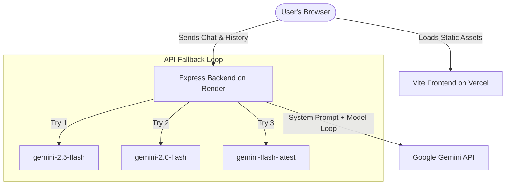

# Nexora AI - Academic Companion for Engineering Students (Decoupled)

Nexora AI is a full-stack, highly interactive, and responsive web application designed to assist computer science and engineering students in learning, debugging, and revising core concepts. The application features a premium, dark glassmorphism dashboard UI with neon glow accents and is powered by the **Google Gemini API** with a resilient model fallback system.

This codebase has been restructured into a decoupled architecture separating the client (Vite-powered frontend) and the server (Express Node.js backend). This allows for faster frontend load times, bypasses Render cold starts for static files, and separates the presentation layer from backend logic.

---

## 🏗️ System Architecture



---

## 📁 Repository Structure

```txt
ai-study-buddy/
├── backend/                  # Express Proxy API Server (Ready for Render)
│   ├── controllers/
│   │   └── chatController.js # Gemini integration & fallback logic
│   ├── routes/
│   │   └── chat.js           # API route registrations
│   ├── .env.example          # Environment variables template
│   ├── package.json          # Node dependencies & start scripts
│   └── server.js             # Express application & CORS config
│
├── frontend/                 # Vite + Vanilla HTML/CSS/JS (Ready for Vercel)
│   ├── src/
│   │   ├── script.js         # Frontend controller & markdown parser
│   │   └── styles.css        # Glassmorphic UI styles & keyframe animations
│   ├── .env.example          # Environment variables template
│   ├── index.html            # Core HTML5 entrypoint
│   ├── package.json          # Dev dependencies & build scripts
│   └── vite.config.js        # Vite configuration
│
├── render.yaml               # Blueprint for Render Infrastructure-as-Code
└── README.md                 # Project documentation
```

---

## 🛠️ Local Development Setup

### 1. Prerequisites
- **Node.js** (v18+ recommended)
- **Google Gemini API Key** (Get one at [Google AI Studio](https://aistudio.google.com/))

### 2. Configure Backend
1. Navigate into the `backend/` directory:
   ```bash
   cd backend
   ```
2. Install dependencies:
   ```bash
   npm install
   ```
3. Copy `.env.example` to `.env`:
   ```bash
   cp .env.example .env
   ```
4. Insert your Gemini API Key in the `.env` file:
   ```env
   PORT=5000
   NODE_ENV=development
   GEMINI_API_KEY=your_actual_gemini_api_key_here
   FRONTEND_URL=http://localhost:5173
   ```
5. Start the backend development server:
   ```bash
   npm run dev
   ```
   * The server runs at `http://localhost:5000`
   * Health endpoint is available at `http://localhost:5000/health`

### 3. Configure Frontend
1. Open a new terminal window and navigate into the `frontend/` directory:
   ```bash
   cd frontend
   ```
2. Install dev dependencies:
   ```bash
   npm install
   ```
3. Copy `.env.example` to `.env`:
   ```bash
   cp .env.example .env
   ```
4. Confirm `VITE_API_URL` points to the local backend:
   ```env
   VITE_API_URL=http://localhost:5000
   ```
5. Launch the Vite dev server:
   ```bash
   npm run dev
   ```
   * The frontend client will start at `http://localhost:5173`

---

## ☁️ Deployment Guide

### 1. Backend Deployment (Render)
To deploy the backend to Render, use the blueprint file `render.yaml` or create a manual service:

#### Manual Service Creation
1. Go to [Render Dashboard](https://dashboard.render.com/) and click **New > Web Service**.
2. Connect your GitHub repository.
3. Configure the following settings:
   - **Name**: `ai-study-buddy-backend`
   - **Environment**: `Node`
   - **Root Directory**: `backend`
   - **Build Command**: `npm install`
   - **Start Command**: `npm start`
4. Add the following **Environment Variables**:
   - `GEMINI_API_KEY`: *(Your Google AI Studio API Key)*
   - `NODE_ENV`: `production`
   - `FRONTEND_URL`: *(Your final Vercel frontend URL, e.g. `https://ai-study-buddy.vercel.app`)*
5. Click **Deploy Web Service**.

---

### 2. Frontend Deployment (Vercel)
Vercel is optimized for static sites and frontend assets, providing near-instant loading times.

1. Go to [Vercel Dashboard](https://vercel.com/) and click **Add New > Project**.
2. Import your GitHub repository.
3. Configure the deployment settings:
   - **Framework Preset**: `Other` (or Vite if automatically detected)
   - **Root Directory**: `frontend`
   - **Build Command**: `npm run build`
   - **Output Directory**: `dist`
4. In the **Environment Variables** section, add:
   - Key: `VITE_API_URL`
   - Value: *(Your Render backend service URL, e.g. `https://ai-study-buddy-backend.onrender.com`)*
5. Click **Deploy**.

---

## 🩺 System Verification & Health Check
- The backend contains a `/health` endpoint that can be queried to keep the Render dyno active or verify deployment statuses:
  ```json
  // GET http://localhost:5000/health
  {
    "status": "UP",
    "timestamp": "2026-05-23T09:49:28.069Z",
    "env": "development"
  }
  ```
- To test the backend endpoint locally using PowerShell, run:
  ```powershell
  Invoke-RestMethod -Uri http://localhost:5000/health
  ```
- To test the frontend production compiler, run inside `frontend/`:
  ```bash
  npm run build
  ```
  Vite should output files into `frontend/dist/` without errors.
